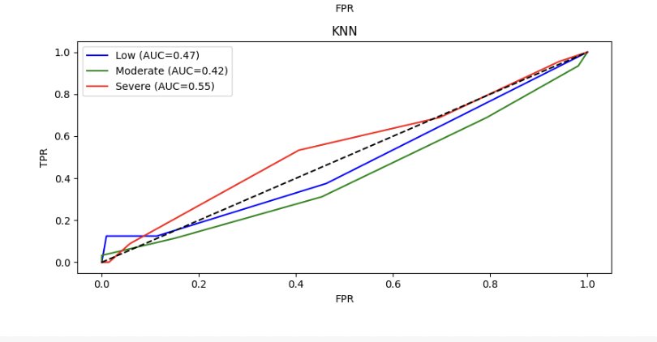
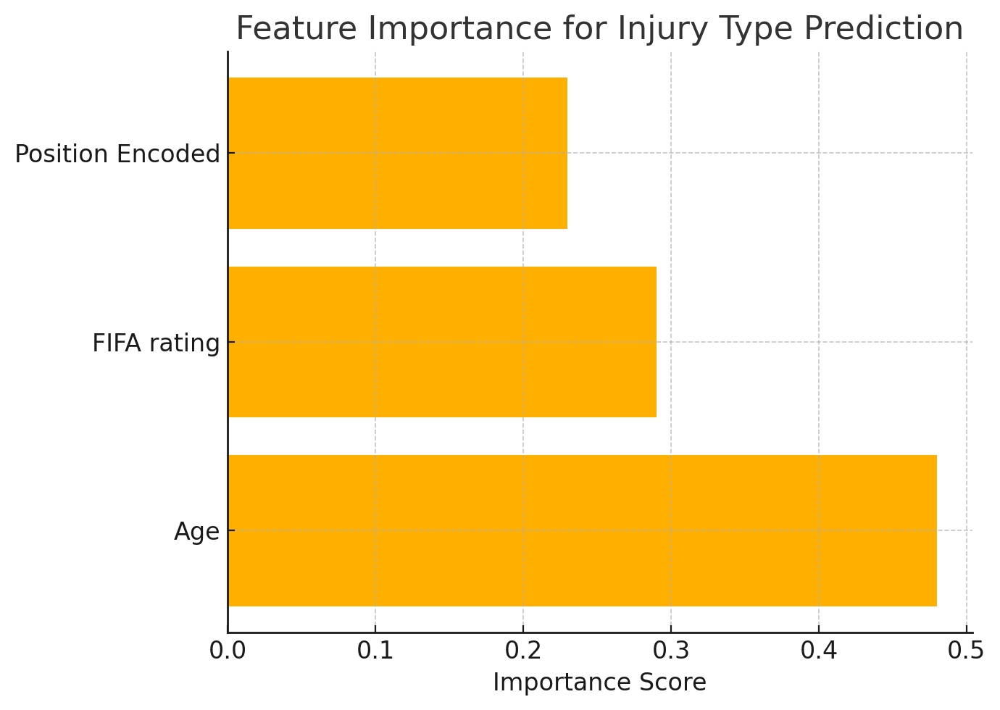

# cs668

## Table of Contents
- [Abstract](#abstract)
- [Research Questions](#research-questions)
- [Dataset](#dataset)
- [Methodology](#methodology)
- [Results](#results)
- [Limitations](#limitations)

# Injury Prediction in Professional Football Players

# Abstract
This project investigates the relationship between professional football players’ characteristics and their injury outcomes, with a focus on injury severity and type. Using a dataset of 656 recorded injury cases, we examined how traits such as age, position, and FIFA rating correlate with both the nature and seriousness of injuries. We then applied machine learning models—including Random Forest, Gradient Boosting, and Logistic Regression—to assess the predictability of injury outcomes from player features. Model performance was evaluated using accuracy, F1 score, and multi-class ROC curves. Although model accuracy varied by injury category, the study demonstrates that basic player profile data can offer meaningful insights into injury patterns and potential predictive value.

---

## Research Questions

1. **Which player traits** (age, position, FIFA rating) are most associated with different **injury types or severities**?
2. **Can machine learning** models predict injury severity or injury type based on player characteristics?

---

## Dataset
📂 The dataset is available here: [player_injuries_impact.csv](./player_injuries_impact.csv)

- **Total Entries:** 656 injury records
- **Features:**  
  - Player Age  
  - Position  
  - FIFA Rating  
  - Injury Type  
  - Dates of Injury and Return
- **Target Variables:**
  - **Severity:** Low, Moderate, Severe (based on days missed)
  - **Injury Type:** e.g., Hamstring strain, ACL tear

---

## Methodology

The project began with data cleaning, where missing or inconsistent values were removed, and injury severity was calculated based on the number of days missed between the recorded injury and return dates. Severity was then categorized as low, moderate, or severe to allow for clearer comparison across cases.

Categorical features, such as position and injury type, were encoded numerically to ensure compatibility with machine learning algorithms. Statistical methods were used to understand baseline relationships: ANOVA tested for differences in age and FIFA rating across injury outcomes, while chi-square tests examined any association between player position and injury category. These tests were selected because they are well-established for comparing groups and detecting associations in categorical and numerical data.

For prediction tasks, five classification models were used—Logistic Regression, Random Forest, Gradient Boosting, Support Vector Machines, and K-Nearest Neighbors. This range of models was chosen to compare linear and non-linear methods, and to evaluate performance under different assumptions. Model accuracy and F1 scores were used to assess classification success, with ROC curves providing additional insight into how well each model distinguished between classes.

---

## Results

- **Age** was significantly associated with both injury severity and type (p < 0.05)
- **Position** was **not** significantly related to injury type
- **Best Models:**
  - Logistic Regression performed best for severity prediction
  - Gradient Boosting gave highest F1 scores for injury type
- ROC analysis showed models were most effective at predicting **low-severity injuries**

### ROC Curve – Injury Type Prediction

### ROC Curve – Severity Prediction

### Feature Importance Chartgit push origin main

---

## Limitations

- Only includes injured players — no control group of uninjured players
- Injury type distribution is imbalanced
- Limited features — does not include training load, match intensity, or biomechanics

---